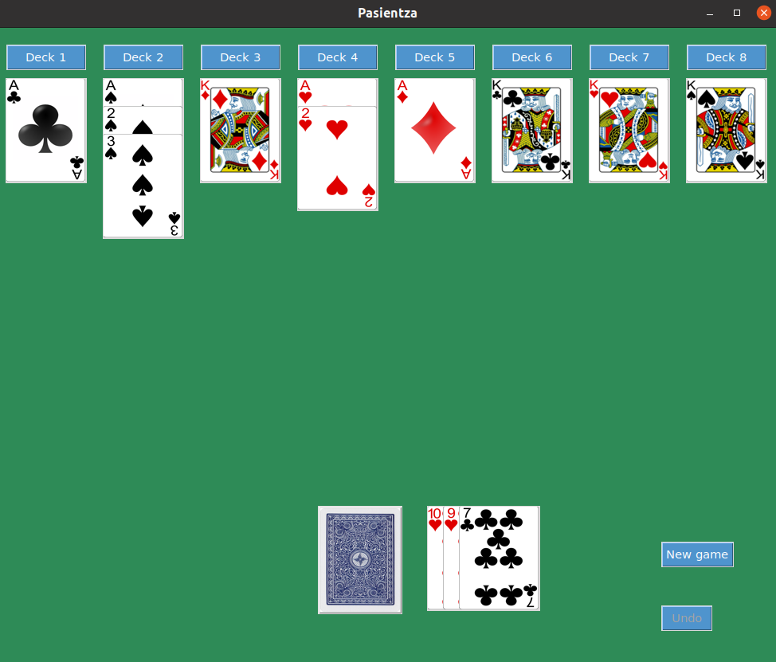

# "Pasientza" (Solitaire) Card Game
Pasientza is a simple solo card game that requires a standard deck of 52 cards.

## Requirements
- The game was built using python 3.8.10 but should work for all 3.0+ python versions.
- PILLOW

Note: When installing Pillow keep in mind [this](https://pillow.readthedocs.io/en/stable/installation.html).

Install the dependencies from `requirements.txt` using `pip`:
Open a terminal window in the current directory and type:
`pip install -r requirements.txt` 

## How to run the game
After verifying that you have the required dependencies, open a terminal window in the current directory and type:

`python3 Pasientza.py` or `python Pasientza.py` 

(assuming you already have Python 3 in your PATH).

## Pasientza Game Rules

### Objective
Successfully place all the cards from the deck onto the eight stacks following the order:
- A->2->3->...->K **and** the same suit **or**
- K->Q->J->...->A **and** the same suit

### Setup
- Use a standard 52-card deck.
- Create eight empty stacks for organizing the cards and an empty stack to keep the cards removed from the deck, called "soros".

### Gameplay
1. Remove three cards from the deck and place them face up on the "soros".
2. If the top card of "soros" is "A" or "K," place it on one of the eight empty stacks. Execute step 2 again.
3. If the top card of "soros" has **both** the following properties:
   -  Its value is one larger or smaller than the top card of any of the eight stacks.
   -  It has the same suit as that specific top card
  
    Place the top card of "soros" on the top of that matching stack and go back to step 2.
4. If the top card of "soros" does not fit the criteria in step 2 or 3, go back to step 1.
5. If the deck becomes empty, reverse the "soros" and create a new deck from it. Go to step 1.
6. If both the deck and "soros" are empty, you have won the game.
7. If you keep drawing cards, and nothing changes, start a new game.

## TODO
- Replace "Deck i" buttons with clicks on stacks.
- Make some arguments optional in the GameWindow class.
- Make window resizable, dynamic.
- Add binding keys to the window.
- Add logs.
- Make a pop-up window on winning.
- Write an exception class.
- Get user info and save it to a database.
- Count games played and win/loss ratio.

Michail E. Koutrakis
Github: https://github.com/mkoutra
